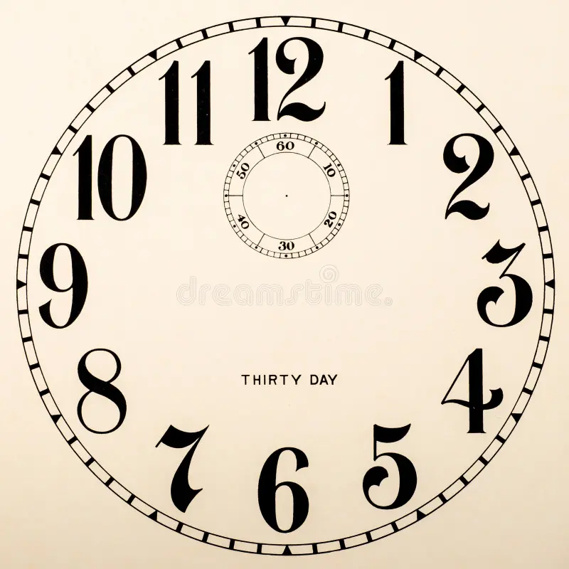

# 🕒 Analog Clock Animation

A simple and elegant **Analog Clock Animation** built using **HTML** and **CSS**. This project demonstrates how CSS animations can be used to rotate the hour, minute, and second hands to simulate a fast-forward analog clock.

## 📸 Preview



## ✨ Features

- 🎨 Clean analog clock design
- ⚡ Pure HTML & CSS (No JavaScript)
- 🔄 Smooth rotation animations
- 📱 Responsive centered layout
- 🎯 Beginner-friendly project

## 🛠️ Built With

- HTML5
- CSS3
- CSS Animations

## 📂 Project Structure

```
Analog-Clock/
│── index.html
│── style.css
│── bg.png
└── README.md
```

## 🚀 Getting Started

1. Clone the repository

```bash
git clone https://github.com/your-username/analog-clock.git
```

2. Open the project folder.

3. Run `index.html` in your browser.

No additional setup or installation is required.

## 🎯 How It Works

The clock uses CSS `@keyframes` animations to continuously rotate the clock hands.

Current animation timings:

| Clock Hand | Animation Duration |
|------------|-------------------:|
| Hour Hand | 2 seconds |
| Minute Hand | 1 second |
| Second Hand | 6 seconds |

> **Note:** These timings are intentionally sped up to create a fast-forward clock animation and do not represent real-time movement.

## 📚 What I Learned

- Positioning elements using CSS
- Working with `transform-origin`
- Using CSS keyframe animations
- Layering elements with `position: absolute`
- Creating simple UI animations

## 🔮 Future Improvements

- Add JavaScript to display real-time clock.
- Make the clock fully responsive.
- Add dark/light mode.
- Add smooth ticking effect.
- Add digital time display.

## 🤝 Contributing

Contributions, suggestions, and improvements are always welcome.

## ⭐ Support

If you like this project, consider giving it a ⭐ on GitHub.

---

**Made with ❤️ by Zeeshan Ahmed**
